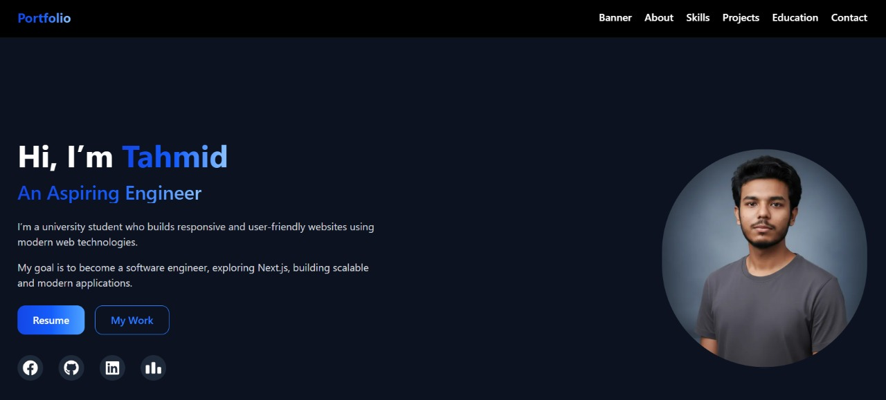

  

# 💫 About Me:
I'm **Tahmid Khan**, a Computer Science student at Metropolitan University and a passionate **Web developer**.   I love building web apps, problem solving and exploring modern web technologies.

# 💻 Tech Stack:

# 💼 Professional Profiles

  

# 📊 GitHub Stats:
 
 

## 🏆 GitHub Trophies

### ✍️ Random Dev Quote

---

<!-- Proudly created with GPRM ( https://gprm.itsvg.in ) -->
